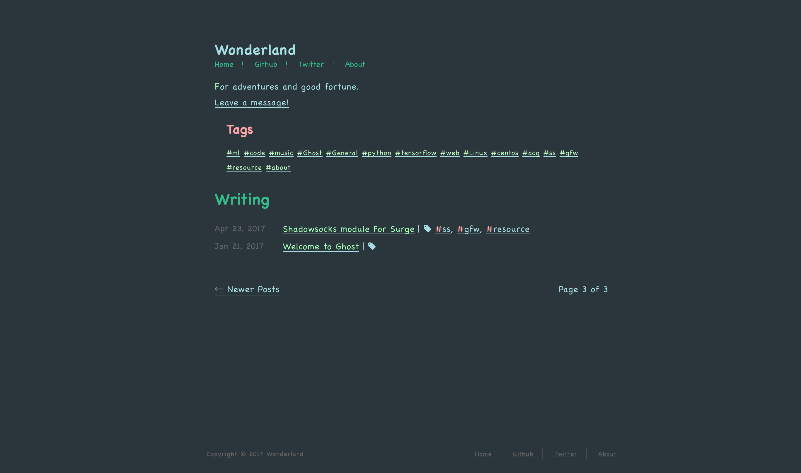

# Wonderland
A simple, clean theme for Ghost.

## Installation

1. Download the latest version of Wonderland.
2. Log into your blog: YOURBLOG/ghost.
3. Select General from the navigation menu on the left of your admin area.
4. Scroll down to the Themes section and click on the green Upload a Theme button.
5. Choose the theme zip file you downloaded in step one.